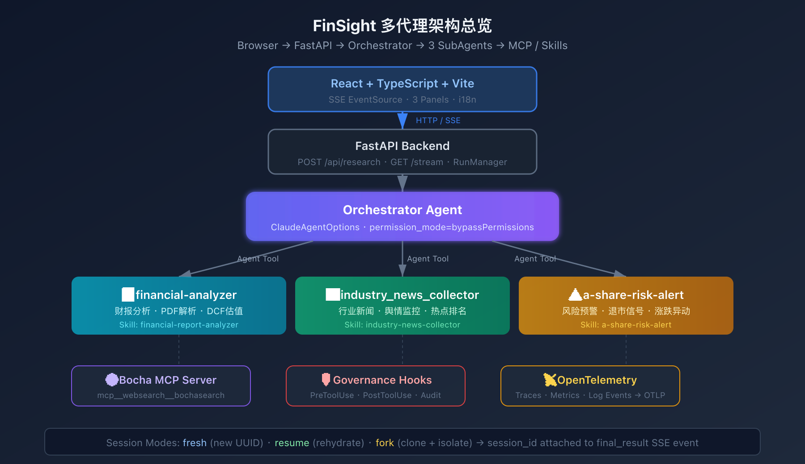
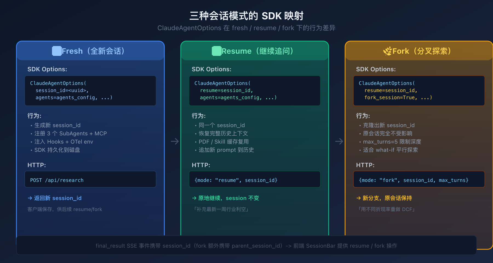
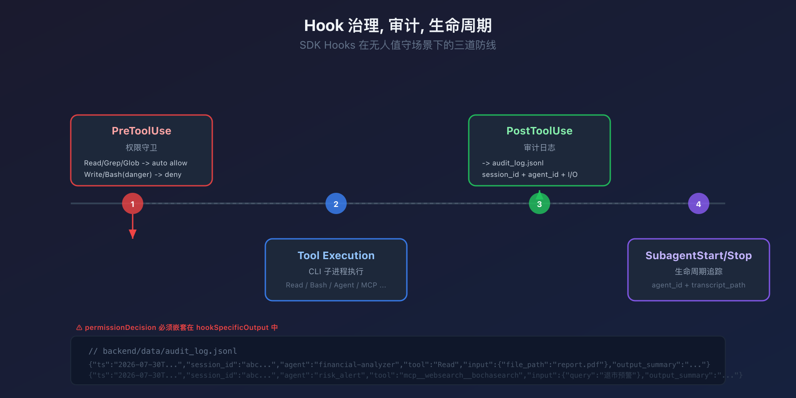
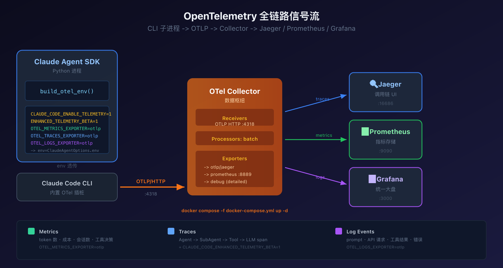
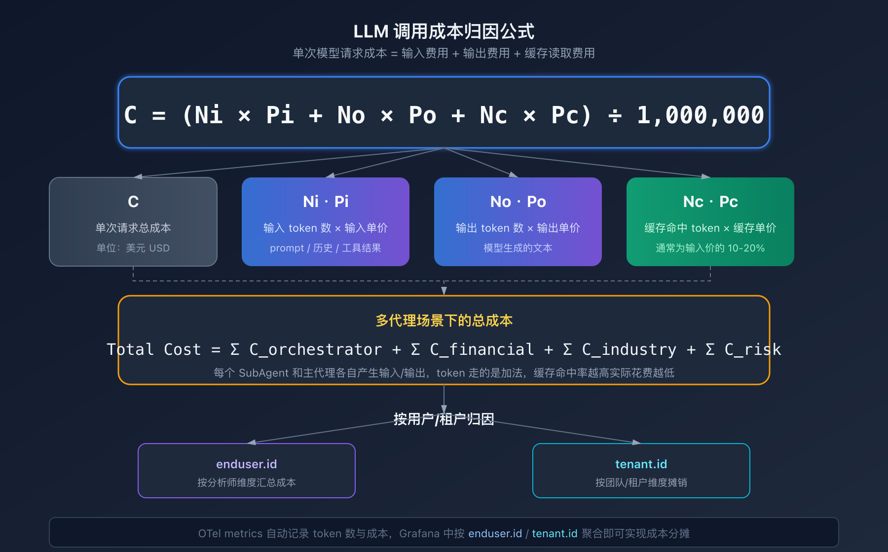
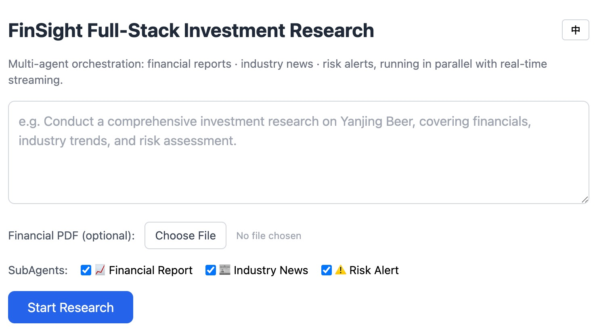

# 用 Claude Agent SDK 搭一个多代理投研平台，我把踩过的坑全写进来了

事情是这样的。

前段时间我在研究 Claude Agent SDK 的时候，发现了一个很有意思的设计模式。它可以把一个复杂的任务拆成几个独立的子代理，每个子代理有自己的上下文窗口、专用工具和系统提示词，主代理只需要像调用工具一样把它们调起来就行。

我当时就想，这玩意用来做投研太合适了。

你想，一份完整的投资研究报告需要什么？**财务数据分析、行业新闻搜集、风险预警**，这三个方向完全是独立的信息源。一个人同时干三件事容易串味，但如果分给三个专精的代理各干各的，最后汇总，效率和质量都能上去。

于是我花了一些时间搭了一个叫 **FinSight** 的项目，从零开始踩了不少坑。今天就聊聊这个过程中我觉得最值得分享的几个点：多代理编排的架构选择、会话管理的三种模式、无人值守下的治理难题，还有全链路可观测怎么接。

不是教程，就是我踩坑和发现的过程。

---

## 一、多代理编排，为什么选 SubAgent-as-tool

先说架构。

Claude Agent SDK 提供了一个 `ClaudeAgentOptions` 的配置项，里面有个 `agents` 参数，你可以往里面塞一堆 `AgentDefinition`。每个 `AgentDefinition` 长这样

```python
from claude_agent_sdk import AgentDefinition

# 定义一个财报分析子代理
# description 是主代理决定何时调用的唯一依据，必须写得具体
# prompt 是子代理的系统提示词，决定它的专业领域和行为边界
# tools 限制子代理能调用的工具，避免它越权
# skills 挂载黑盒复用的 Skill，这里直接复用参考实现
# model="inherit" 表示继承主代理的模型配置，无需单独指定
financial_analyzer_agent = AgentDefinition(
    description="财务报告分析专家，擅长解析 PDF 财报并生成结构化 Markdown 报告",
    prompt="你是一位资深财务分析师...",
    tools=["Read", "Grep", "Glob", "Bash", "Write", "Edit"],
    skills=["financial-report-analyzer"],
    model="inherit",
)
```

这个模式叫 **SubAgent-as-tool**。主代理看到这些子代理，就像看到一把把工具，什么时候调、调哪个，由主代理自己判断。子代理跑的时候，上下文是隔离的，它读的文件、搜索的结果、中间推理过程，全都在自己的上下文窗口里，主代理只能看到最终结论。

这个隔离特别重要。Anthropic 在官方工程博客里披露过他们内部多代理研究系统的数据，**多代理架构相比单代理在内部研究基准上提升了 90.2%，代价是 token 消耗大约是单代理的 15 倍**。听起来成本很高，但你想想，三个子代理并行跑，每个都在自己的领域深耕，比起一个代理在三个领域之间来回切换角色，质量上的提升远超 token 的代价。而且他们自己也说，这种架构只适合真正需要多方向探索的复杂任务，简单问答用它反而亏。



架构图里可以看到，浏览器通过 SSE 连到 FastAPI 后端，后端启动一个 Orchestrator 主代理，主代理再通过 Agent 工具调度三个子代理。Bocha 搜索作为 MCP server 共享给新闻和风险代理，Hooks 负责治理审计，OpenTelemetry 负责全链路监控。

说真的，我一开始想过自己手搓一个 Function-Calling 的编排逻辑，写 `asyncio.gather()` 做并行调度。但后来发现 SDK 已经把这些都封装好了，你只需要在 prompt 里告诉主代理「这些任务可以并行调用」，它自己就会在一条消息里同时发多个 Agent 工具调用，SDK 底层自动并行执行。

这个设计让我省了至少几百行编排代码。

```python
# backend/agents/registry.py
# 三个子代理的注册表，key 就是 Agent 工具调用时使用的名字
from backend.agents.financial import financial_analyzer_agent
from backend.agents.industry_news import industry_news_collector_agent
from backend.agents.risk_alert import risk_alert_agent


def build_agents_config() -> dict[str, AgentDefinition]:
    """Return the SubAgent config dict registered on the orchestrator."""
    return {
        "financial-analyzer": financial_analyzer_agent(),
        "industry_news_collector": industry_news_collector_agent(),
        "a-share-risk-alert": risk_alert_agent(),
    }


# 单例，所有 research run 复用同一份配置
agents_config = build_agents_config()
```

不过这里有个坑，部分国产模型自主规划能力有限，它会倾向于直接调用 Skill，而不是走 SubAgent。所以我**在前端提示词里硬编码了一句「必须使用以下子 agent 完成任务，不能自行调用 skills」**，强制主代理走 Agent 工具路由。这句话在 `backend/api/research.py` 的 `_build_prompt()` 里

```python
def _build_prompt(req: ResearchRequest) -> str:
    """Augment the user prompt with file path and explicit SubAgent routing."""
    if req.mode != "fresh":
        # Resume / fork 复用已有上下文，不需要再注入路由指令
        return req.prompt

    parts: list[str] = []
    if req.agents:
        # 显式指定要调度的子代理，防止主代理绕过 Agent 工具直接调用 Skill
        names = "、".join(req.agents)
        parts.append(f"必须使用以下子agent完成任务，不能自行调用skills：{names}。")

    parts.append(req.prompt)

    if req.file_id:
        # 把上传的 PDF 路径拼进提示词，financial-analyzer 会读取它
        path = f"{settings.upload_dir}/{req.file_id}.pdf"
        parts.append(
            f"财报PDF文件路径为：{path}（请使用 financial-analyzer agent 读取并分析）。"
        )

    return "\n".join(parts)
```

---

## 二、会话管理，fresh / resume / fork 三种模式

这个是我觉得整个 SDK 设计中最优雅的部分。

传统的 API 调用是无状态的，你发一个请求，拿一个响应，结束。但投研不是这样，分析师可能会先跑一份完整分析，然后追问「补充最近一周的行业利空」，或者分叉出一条「用不同折现率重做 DCF 估值」的探索分支。

SDK 原生支持三种会话模式

```python
# fresh，全新会话，生成新 session_id
# 显式传入 UUID 是关键，否则 SDK 可能使用临时会话，后续无法 resume/fork
options = ClaudeAgentOptions(
    session_id=str(uuid.uuid4()),
    agents=agents_config,                       # 注册三个子代理
    mcp_servers={"websearch": websearch_server},  # 挂载 Bocha 搜索
    hooks=build_hooks(),                        # 注入治理 Hook
    env=build_otel_env(),                       # 注入 OpenTelemetry 环境变量
)

# resume，继续追问，同一个 session_id
# 注意：参考文档说 resume 只需要传 session_id，但实际测试发现 SDK 不总是可靠恢复 SubAgent 定义
options = ClaudeAgentOptions(
    resume=session_id,
    agents=agents_config,                       # 必须显式传入
    mcp_servers={"websearch": websearch_server},  # 必须显式传入
    hooks=build_hooks(),
    env=build_otel_env(),
)

# fork，分叉探索，克隆出新 session_id，原会话不受影响
# max_turns 限制分支深度，避免无限探索
options = ClaudeAgentOptions(
    resume=session_id,
    fork_session=True,
    max_turns=5,
    agents=agents_config,
    mcp_servers={"websearch": websearch_server},
    hooks=build_hooks(),
    env=build_otel_env(),
)
```



这里有个坑我踩了很久。最初按照参考文档的说法，resume 和 fork 只传 `resume=session_id` 就行，SDK 会从存储的 session 文件里恢复 agents 和 MCP 配置。但实际上，**SDK 并不总是可靠地恢复 SubAgent 定义**。

我在测试 fork 的时候发现，fork 出来的会话启动了一个 `general-purpose` 类型的默认代理，而不是我配置的三个专用子代理。后端日志显示 SubagentStart hook 触发了，但 agent_type 是 `general-purpose`，完全不对。

修复方式很简单但文档没说，**resume 和 fork 的时候也要显式传入 `agents=agents_config` 和 `mcp_servers`**，不能依赖 SDK 的 session 恢复机制。

另一个值得注意的点是 `session_id` 的获取。SDK 在运行结束后会返回一个 `ResultMessage`，里面的 `session_id` 字段就是这次会话的 ID。对于 fresh 和 fork，这是一个新 ID；对于 resume，跟之前一样。我们把这个 ID 附在 SSE 的 `final_result` 事件里返回给前端，前端就能基于它发起 resume 或 fork。

```python
# backend/agents/orchestrator.py
async def _translate(msg: Any, ctx: _RunContext) -> AsyncIterator[dict[str, Any]]:
    """Convert a single SDK message into typed SSE events."""
    if isinstance(msg, ResultMessage):
        report = msg.result or ""
        # 从 SDK 返回的 ResultMessage 中捞出 session_id
        # fresh/resume 与输入一致；fork 会返回全新的分支 session_id
        session_id = getattr(msg, "session_id", None)
        yield {
            "type": "final_result",
            "agent": "orchestrator",
            "data": {
                "report": report,
                "disclaimer": DISCLAIMER,
                "session_id": session_id or "",
            },
        }
        return
```

前端拿到 `session_id` 后，SessionBar 组件就能展示当前会话状态，并提供「继续追问」和「分叉探索」两个操作按钮。

---

## 三、无人值守，三道防线

把多代理系统放到服务器上跑，最大的问题是什么？**没人看着它**。

CLI 脚本在本地跑的时候，工具调用的权限确认弹出来你点一下就行。但在后端服务里，没有人去点「允许」。SDK 的解决方案是 `permission_mode="bypassPermissions"`，直接跳过所有权限确认。但这等于完全不设防，一个 hallucination 就可能让代理执行 `rm -rf`。

这就是 Hook 机制的价值。SDK 提供了多个生命周期 Hook，在工具调用前后、子代理启停、会话结束等节点都会触发回调。我用其中几个搭建了三道防线。



**第一道防线，PreToolUse 权限守卫。** 在每次工具调用前触发，自动判断是放行还是拒绝。只读工具如 Read、Grep、Glob 直接放行，高危操作如 Write、Edit 敏感文件、destructive Bash 命令直接拒绝。

```python
# backend/agents/hooks.py
READONLY_TOOLS = {"Read", "Glob", "Grep"}

# 高危 Bash 模式，只要命中就拦截
DANGEROUS_BASH_PATTERNS = (
    r"rm\s+-rf\s+/",
    r"mkfs\.",
    r":\(\)\s*\{\s*:\|\:\s*&\s*\}",  # fork bomb
    r">\s*/dev/(sda|sd[b-z]|nvme|disk)",
    r"dd\s+if=.*of=/dev/",
)

# 受保护路径，禁止写操作
PROTECTED_PATH_PREFIXES = ("/etc", "/sys", "/proc", "C:\\\\Windows")
PROTECTED_FILE_NAMES = {".env"}


async def pre_tool_guard(
    input_data: HookInput,
    tool_use_id: str | None,
    context: HookContext,
) -> dict[str, Any]:
    """Layered permission guard for headless agent runs.

    Returns:
        - allow: for read-only tools.
        - deny: for protected-file writes or destructive Bash commands.
        - {}: for anything else, letting the SDK fall back to its default.
    """
    if input_data.get("hook_event_name") != "PreToolUse":
        return {}

    data = PreToolUseHookInput(input_data)
    tool_name = data.get("tool_name", "")
    tool_input = data.get("tool_input") or {}

    # 快速路径：只读工具自动放行，无需人工确认
    if tool_name in READONLY_TOOLS:
        return {
            "hookSpecificOutput": {
                "hookEventName": "PreToolUse",
                "permissionDecision": "allow",
                "permissionDecisionReason": "read-only tool",
            }
        }

    # 拦截对 .env 或系统目录的写操作
    if tool_name in {"Write", "Edit", "MultiEdit"}:
        file_path = tool_input.get("file_path") or tool_input.get("path") or ""
        if _is_protected_path(str(file_path)):
            reason = f"{tool_name} on protected path is not allowed in headless mode"
            return _deny(reason)

    # 拦截破坏性 Bash 命令
    if tool_name == "Bash":
        command = tool_input.get("command", "")
        if _is_dangerous_command(str(command)):
            return _deny("destructive Bash command blocked")

    # 其余情况不干预，让 SDK 走默认流程
    return {}
```

这里有个巨坑。`permissionDecision` 字段**必须嵌套在 `hookSpecificOutput` 里面**，不能直接放在返回字典的顶层。我一开始按照直觉写了顶层，结果 CLI 完全无视我的决策，该放行的没放行，该拦截的没拦截。查了 SDK 的 `SyncHookJSONOutput` 类型定义才发现嵌套结构的要求。

**第二道防线，PostToolUse 审计日志。** 每次工具调用后触发，把调用的完整信息写入 JSONL 文件。这样每一份投研报告都可以回溯到它调用了哪些工具、读了哪些文件、搜了什么关键词。

```python
async def audit_logger(
    input_data: HookInput,
    tool_use_id: str | None,
    context: HookContext,
) -> dict[str, Any]:
    """Append a JSONL record for every completed or failed tool call."""
    event_name = input_data.get("hook_event_name")
    if event_name not in {"PostToolUse", "PostToolUseFailure"}:
        return {}

    try:
        record = _build_audit_record(input_data, tool_use_id)
        _append_jsonl(record)
    except Exception as exc:
        # 审计失败不能影响主流程，必须吞掉异常
        logger.exception("audit_logger failed to record tool call: %s", exc)

    return {}


def _build_audit_record(
    input_data: HookInput,
    tool_use_id: str | None,
) -> dict[str, Any]:
    """Normalize a PostToolUse* event into a flat JSONL record."""
    event_name = input_data.get("hook_event_name")
    base = {
        "ts": datetime.now(timezone.utc).isoformat(timespec="milliseconds"),
        "session_id": input_data.get("session_id") or "",
        "agent_id": input_data.get("agent_id") or None,
        "hook": event_name,
        "tool_name": input_data.get("tool_name") or "",
        "tool_use_id": tool_use_id or input_data.get("tool_use_id") or "",
        "tool_input": input_data.get("tool_input") or {},
    }

    if event_name == "PostToolUse":
        data = PostToolUseHookInput(input_data)
        # 工具输出可能很大，只存前 500 字符摘要
        base["tool_output_summary"] = _summarize(data.get("tool_response"))
    elif event_name == "PostToolUseFailure":
        data = PostToolUseFailureHookInput(input_data)
        base["tool_output_summary"] = _summarize(data.get("error"))

    return base
```

**第三道防线，SubagentStart / SubagentStop 生命周期追踪。** 子代理启动和结束时触发，记录 agent_id 和 transcript_path。这样即使主代理只看到最终结果，我们也能通过日志知道哪个子代理先启动、哪个卡住了、哪个失败了。

三道防线加在一起，让这个无人值守的系统有了基本的治理能力。不是完美的，但至少不会因为一个 hallucination 就把服务器搞炸。

---

## 四、OpenTelemetry，零代码改动的全链路监控

治理解决了安全问题，但还有另一个维度的问题，**你怎么知道系统跑得好不好？**

开发人员关心调用链，主代理调了哪些子代理、子代理又调了哪些工具、哪个环节最慢。团队 lead 关心成本，这次分析花了多少 token、钱花哪了、能不能按人分摊。

这些需求传统的日志做不到，你需要分布式追踪。而 Claude Agent SDK 在这件事上的设计让我挺惊喜的，**CLI 子进程内置了 OpenTelemetry 插桩**，你不需要改一行业务代码，只需要通过 `ClaudeAgentOptions.env` 传入正确的环境变量就行。



OTel 导出三种信号

| 信号 | 内容 | 启用方式 |
|------|------|----------|
| **Metrics** | token 数、成本、会话数、工具决策计数器 | `OTEL_METRICS_EXPORTER=otlp` |
| **Log Events** | prompt 提交、API 请求、工具结果的结构化记录 | `OTEL_LOGS_EXPORTER=otlp` |
| **Traces** | Agent → SubAgent → Tool → LLM 的完整调用链 span | `OTEL_TRACES_EXPORTER=otlp` + `CLAUDE_CODE_ENHANCED_TELEMETRY_BETA=1` |

我把环境变量的生成封装成了一个工厂函数

```python
# backend/agents/telemetry.py
from urllib.parse import quote


def build_otel_env(
    service_name: str = "iiras",
    enduser_id: str = "",
    tenant_id: str = "",
) -> dict[str, str]:
    """Build the OpenTelemetry env dict for ClaudeAgentOptions.env.

    Returns an empty dict when OTEL_EXPORTER_OTLP_ENDPOINT is unset,
    so telemetry is opt-in and never blocks a run.
    """
    endpoint = settings.otel_exporter_otlp_endpoint
    if not endpoint:
        # 端点没配就关闭遥测，开发环境无感知
        return {}

    # Resource attributes 会附在每条 span / metric / log event 上
    attrs = [
        "service.version=1.0.0",
        "deployment.environment=development",
    ]
    if enduser_id:
        # 对特殊字符做 percent-encode，防止破坏 OTEL_RESOURCE_ATTRIBUTES 解析
        attrs.append(f"enduser.id={quote(enduser_id)}")
    if tenant_id:
        attrs.append(f"tenant.id={quote(tenant_id)}")

    return {
        # 总开关，没有它 CLI 不会导出任何信号
        "CLAUDE_CODE_ENABLE_TELEMETRY": "1",
        # Traces 的 beta 开关，调用链目前还是 beta 特性
        "CLAUDE_CODE_ENHANCED_TELEMETRY_BETA": "1",
        # 三种信号各选 otlp exporter，千万不要用 console
        "OTEL_TRACES_EXPORTER": "otlp",
        "OTEL_METRICS_EXPORTER": "otlp",
        "OTEL_LOGS_EXPORTER": "otlp",
        # OTLP 传输协议用 HTTP/protobuf，比 gRPC 少一个依赖
        "OTEL_EXPORTER_OTLP_PROTOCOL": "http/protobuf",
        "OTEL_EXPORTER_OTLP_ENDPOINT": endpoint,
        # 服务名与资源属性，用于在 Jaeger/Grafana 中筛选
        "OTEL_SERVICE_NAME": service_name,
        "OTEL_RESOURCE_ATTRIBUTES": ",".join(attrs),
        # 导出间隔降到 1 秒
        # CLI 默认 metrics 60 秒、traces/logs 5 秒导出一次
        # 投研任务可能几分钟就跑完，不调低的话进程结束时数据还没发出去
        "OTEL_METRIC_EXPORT_INTERVAL": "1000",
        "OTEL_LOGS_EXPORT_INTERVAL": "1000",
        "OTEL_TRACES_EXPORT_INTERVAL": "1000",
    }
```

这个函数有几个设计决策值得展开说。

**opt-in 设计。** 端点没配就返回空字典，遥测完全关闭。这样开发的时候不用管 Collector，上线的时候在 `.env` 里加一个 `OTEL_EXPORTER_OTLP_ENDPOINT=http://your-collector:4318` 就开了。

**用户和租户归因。** `enduser.id` 和 `tenant.id` 会附在每条 span、每个 metric、每个 log event 上。在 Grafana 里你可以按分析师筛选成本，按团队聚合 token 用量。

成本的计算公式其实不复杂

```
C = (Ni × Pi + No × Po + Nc × Pc) / 1,000,000
```



其中每一项的含义是

- **C**，单次调用总成本，单位是美元。它是把输入、输出、缓存三部分费用加总后，再按「每百万 token」的单价口径换算出来的结果。
- **Ni**，输入 token 数，即发送给模型的 prompt、历史消息、工具结果的总 token 量。多代理场景下，每个子代理都有自己的输入，所以 Ni 会累加。
- **Pi**，输入 token 单价，单位是美元/百万 token。不同模型价格不同，比如 Sonnet 和 Opus 的输入价能差一个数量级。
- **No**，输出 token 数，模型生成的文本量。输出通常比输入贵，所以 No 对成本的影响往往比 Ni 更大。
- **Po**，输出 token 单价，单位同样是美元/百万 token。通常比输入价高 3-5 倍，是成本的大头。
- **Nc**，缓存命中 token 数。prompt caching 命中后，模型只需要读取已经缓存的 token，这部分有独立计价。
- **Pc**，缓存读取单价，通常是标准输入价格的 10-20%，也就是说比正常输入便宜 80-90%。
- **1,000,000**，因为 Pi、Po、Pc 都是「每百万 token」的报价，所以总费用要除以一百万来得到实际美元数。

多代理场景下，一次投研任务的总成本是所有子代理和主代理各自调用的 C 之和。这就是为什么 token 消耗会是单代理的 15 倍，三个子代理各有自己的输入输出，主代理还要汇总，token 走的是加法。但缓存命中率高的话，实际花费会低很多。OTel 的 metrics 里会自动记录 `cache_read_input_tokens`，你在 Grafana 里可以做一个 `cached_vs_uncached` 的对比图来看缓存效果。

**1 秒导出间隔。** 这个很重要。CLI 默认 metrics 每 60 秒导出一次，traces 和 logs 每 5 秒。但投研任务一次可能就跑三五分钟，如果用默认间隔，进程结束时可能还有一大波数据没发出去。全部降到 1 秒，基本能保证数据不丢。

**内容级日志默认关闭。** OTel 默认只导出结构信息（耗时、模型名、工具名、token 数），不会记录 prompt 内容和工具输出。但有几个开关可以按需开启，`OTEL_LOG_USER_PROMPTS=1` 会记录 prompt 文本，`OTEL_LOG_TOOL_CONTENT=1` 会记录完整的工具输入输出。在投研场景中，财报 PDF 内容、搜索关键词、内部文件路径都可能涉及敏感信息，所以我的建议是默认不开，只有当你的可观测 pipeline 经过安全审批后按需打开。本地审计日志已经覆盖了内容级合规需求。

还有一个雷区。**永远不要把 exporter 设为 `console`**。因为 console 输出会占用 SDK 和 CLI 子进程之间的 stdio 通信通道，导致运行异常。本地调试用 Jaeger all-in-one 这种本地 Collector 就行。

---

## 五、SSE 流式协议，类型化事件

最后简单聊聊前后端怎么通信。

投研任务是个长时间运行的过程，三个子代理可能各跑一两分钟，主代理再花一两分钟汇总。如果等全部跑完再返回结果，用户体验会很差。所以我用了 SSE（Server-Sent Events）做流式推送。

事件类型是固定的，前端可以按类型分别渲染

```
subagent_dispatch  -> 主代理调度了一个子代理
tool_call           -> 某个代理调用了工具（Read/Bash/WebSearch...）
partial_message     -> 流式文本片段，实时渲染打字效果
subagent_result     -> 子代理完成，携带最终 Markdown 报告
final_result        -> 主代理汇总完成，携带完整报告 + session_id
done                -> 流结束，关闭连接
```

前端用 `EventSource` 消费这些事件，三个 SubAgent 面板实时展示状态和内容。我还加了 `sessionStorage` 持久化，页面刷新后不会丢结果，以及中英文切换。



`useSSEStream.ts` 是前端消费 SSE 的核心 Hook。它把每个事件派发到 reducer，更新对应 SubAgent 的状态。有一个细节是 `done` 事件可能为空数据，需要单独处理，不能直接 `JSON.parse`。

```typescript
// frontend/src/hooks/useSSEStream.ts
// 所有事件类型必须与后端 orchestrator 保持一致
const eventTypes = [
  'subagent_dispatch',
  'partial_message',
  'tool_call',
  'subagent_result',
  'final_result',
  'error',
  'done',
] as const;

eventTypes.forEach((eventName) => {
  source.addEventListener(eventName, (e) => {
    const raw = (e as MessageEvent).data;

    // done 事件可能没有 data 字段，直接标记完成即可
    if (!raw) {
      if (eventName === 'done') {
        setState((prev) => {
          const next = { ...prev, done: true };
          saveState(runId, next);
          return next;
        });
      }
      return;
    }

    // 后端 payload 已包含 type、agent、data 三个字段
    const payload = JSON.parse(raw) as SSEEvent;
    setState((prev) => {
      const next = reduceEvent(prev, payload);
      saveState(runId, next);  // 每次更新后持久化到 sessionStorage
      return next;
    });
  });
});
```

reducer 里 `tool_call` 会被收集到每个 SubAgent 的 `toolCalls` 数组里，`SubAgentPanel` 把它渲染成可展开的时间轴。这样分析师不仅能看到最终结论，还能看到代理为了得到这个结论调用了哪些工具、搜了什么、读了什么文件。

```typescript
// SubAgentPanel 中的工具调用时间轴
function ToolCallItem({ entry, idx }: { entry: ToolCallEntry; idx: number }) {
  const [expanded, setExpanded] = useState(false);
  const icon = TOOL_ICONS[entry.tool] || '🔧';
  const summary = summarizeToolInput(entry.tool, entry.input);

  return (
    <div className="border-l-2 border-blue-200 pl-2 py-1">
      <button onClick={() => setExpanded(!expanded)}>
        <span>{icon}</span>
        <span>{entry.tool}</span>
        <span>{summary}</span>
        <span>{entry.time}</span>
      </button>
      {expanded && (
        <pre>{JSON.stringify(entry.input, null, 2)}</pre>
      )}
    </div>
  );
}
```

有一个细节花了些时间处理。CLI 子进程返回的 Agent 工具结果里会附带大量协议元数据，比如 `agentId: a78cf5ef4ead7f68e (internal ID - do not mention to user. Use SendMessage with to: 'a78cf5ef4ead7f68e'...)`。这些是 CLI 内部的代理间通信指令，不应该展示给用户。我在后端写了 `_clean_subagent_report()` 函数用十几个正则把这些噪声剥掉，前端也做了一层兜底清理。

```python
# backend/agents/orchestrator.py
#  agentId 协议尾巴和 usage 标签，会在最后统一处理
_AGENT_ID_TRAILER_RE = re.compile(
    r"\n?agentId: [0-9a-f]+ \(use SendMessage.*?\)\s*", re.DOTALL
)
_USAGE_TRAILER_RE = re.compile(r"\n?<usage>.*?</usage>\s*", re.DOTALL)

# CLI 内部元数据模式，会从 SubAgent 工具结果中剥离
_CLI_METADATA_PATTERNS = [
    re.compile(r"Async agent launched successfully\.", re.DOTALL),
    re.compile(r"\(This tool result is internal metadata.*?into a user-facing reply\.\)", re.DOTALL),
    re.compile(r"agentId: [0-9a-f]+ \(internal ID.*?to continue this agent\.\)", re.DOTALL),
    re.compile(r"agentId: [0-9a-f]+ \(use SendMessage.*?\)", re.DOTALL),
    re.compile(r"The agent is working in the background\..*?(?:completion notification|when it completes)\.", re.DOTALL),
    re.compile(r"Do not duplicate this agent's work.*?it is using\.", re.DOTALL),
    re.compile(r"output_file: \S+\.output", re.DOTALL),
    re.compile(r"Do NOT Read or tail this file.*?overflow your context\.", re.DOTALL),
    re.compile(r"If the user asks for progress.*?completion notification\.", re.DOTALL),
    re.compile(r"You know nothing about its results.*?in the meantime\.", re.DOTALL),
]


def _clean_subagent_report(text: str) -> str:
    """Strip CLI agent-protocol trailers from a SubAgent's final report."""
    for pattern in _CLI_METADATA_PATTERNS:
        text = pattern.sub("", text)
    text = _AGENT_ID_TRAILER_RE.sub("\n", text)
    text = _USAGE_TRAILER_RE.sub("\n", text)
    # 去掉剥离后留下的多余空行
    text = re.sub(r"\n{3,}", "\n\n", text)
    text = text.strip()
    # 如果清理后没什么实质内容，返回空字符串
    if len(text) < 10:
        return ""
    return text
```

---

## 六、回到最初

做完这个项目我有一个很深的感受。

多代理系统这件事，听起来很复杂，但 Claude Agent SDK 把最难的部分封装好了。上下文隔离、并行调度、会话持久化、工具权限管理，这些都是 SDK 在处理。开发者只需要定义好每个代理的角色和工具，设计好治理和监控的流程。

这跟以前写分布式系统完全不一样。以前你得自己管服务发现、负载均衡、链路追踪、熔断降级。现在这些概念在 Agent 体系里都有了对应的抽象，SubAgent 就是微服务，Hook 就是中间件，OpenTelemetry 就是分布式追踪，session_id 就是 trace_id。

但有一件事没变。**你仍然需要想清楚系统的边界在哪里**。哪些操作需要人审批、哪些数据需要脱敏、哪些成本需要归因，这些问题 SDK 不会替你回答。技术工具越强大，设计决策的权重就越高。

这也是我觉得做这个项目最有价值的地方。不是代码本身，而是在做的过程中被迫思考的那些问题。

代码已经开源在 GitHub 上，项目名叫 **FinSight**，地址是 [https://github.com/xiaoyesoso/FinSight](https://github.com/xiaoyesoso/FinSight)。有兴趣的可以去看看，代码注释全英文，架构文档用 OpenSpec 管理，算是比较完整的参考实现。

反正我觉得，多代理编排这个方向，才刚刚开始。

---

以上，既然看到这里了，如果觉得不错，随手点个赞、在看、转发三连吧，如果想第一时间收到推送，也可以给我个星标⭐～

谢谢你看我的文章，我们，下次再见。

---

## 参考与延伸阅读

- [Claude Agent SDK 官方文档](https://code.claude.com/docs/en/agent-sdk/overview)
- [Subagents in the SDK](https://docs.anthropic.com/en/docs/agent-sdk/subagents)
- [Observability with OpenTelemetry](https://code.claude.com/docs/en/agent-sdk/observability)
- [Anthropic 多代理研究系统工程博客](https://www.anthropic.com/engineering/built-multi-agent-research-system)
- [Claude Agent SDK 生产指南](https://inference.net/content/claude-agent-sdk-production-guide/)
- [Bocha AI Search MCP Server](https://chat.mcp.so/server/bocha-search-mcp/BochaAI?tab=content)
- [AWS 使用 CloudWatch 分析 Claude Code 用量](https://aws.amazon.com/blogs/mt/analyzing-claude-code-usage-with-cloudwatch-and-opentelemetry/)
